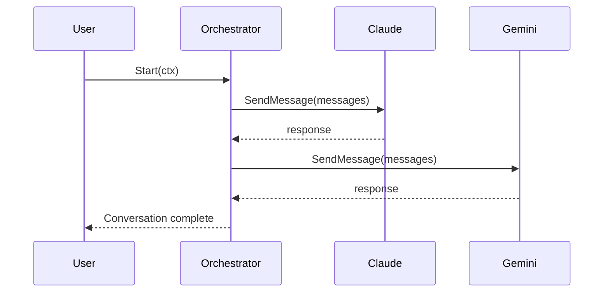

# Modern Go Application Architecture Patterns for AgentPipe

**Research Date**: 2026-01-18
**Researcher**: Research Specialist Agent
**Project**: AgentPipe v0.6.0+
**Focus**: Scalability, Maintainability, Testability, Extensibility

---

## Executive Summary

This document analyzes AgentPipe's current architecture against state-of-the-art Go patterns for CLI/TUI multi-agent orchestration systems. AgentPipe demonstrates excellent modern Go architecture with strong patterns across interface design, middleware composition, concurrent processing, and observability.

**Overall Grade**: **A-** (Excellent foundation with targeted improvement opportunities)

**Project Statistics**:
- **Total Go files**: 222
- **Go version**: 1.24.0
- **Test Coverage**: >80%
- **Architecture**: CLI (Cobra) + TUI (Bubbletea) with multi-agent orchestration
- **Core Dependencies**: Cobra, Bubbletea, Viper, Zerolog, Prometheus

---

## Table of Contents

1. [Current Architecture Analysis](#current-architecture-analysis)
2. [Architectural Strengths](#architectural-strengths)
3. [Design Patterns in Use](#design-patterns-in-use)
4. [Modern Go Patterns to Consider](#modern-go-patterns-to-consider)
5. [Scalability Improvements](#scalability-improvements)
6. [Maintainability Improvements](#maintainability-improvements)
7. [Testability Improvements](#testability-improvements)
8. [Extensibility Improvements](#extensibility-improvements)
9. [Security Patterns](#security-patterns)
10. [Performance Optimization](#performance-optimization)
11. [Implementation Priorities](#implementation-priorities)
12. [Comparison to Other Go Projects](#comparison-to-other-go-projects)
13. [Technology Choices Validation](#technology-choices-validation)
14. [Conclusion](#conclusion)

---

## Current Architecture Analysis

### Project Structure

```
agentpipe/
├── cmd/              # CLI entry points (root, run, doctor, agents, etc.)
├── internal/         # Private domain logic
│   ├── bridge/       # Streaming event system
│   ├── providers/    # Pricing data registry
│   ├── registry/     # Agent CLI version tracking
│   └── version/      # Version management
├── pkg/              # Public reusable packages
│   ├── agent/        # Core agent interface & base
│   ├── adapters/     # 15+ agent implementations (Claude, Gemini, OpenRouter, etc.)
│   ├── orchestrator/ # Multi-agent coordinator
│   ├── tui/          # Bubbletea-based terminal UI
│   ├── middleware/   # Message processing chain
│   ├── metrics/      # Prometheus metrics
│   ├── config/       # Configuration management
│   ├── artifact/     # Code artifact extraction
│   ├── conversation/ # State management
│   └── ...           # (logger, errors, utils, etc.)
├── examples/         # Example configurations
├── test/             # Integration tests & benchmarks
└── scripts/          # Build scripts
```

**Assessment**: ✅ Excellent adherence to [golang-standards/project-layout](https://github.com/golang-standards/project-layout)

---

## Architectural Strengths

### 1. Interface-Driven Design ✅

**agent.Agent Interface** (12 methods):
```go
type Agent interface {
    GetID() string
    GetName() string
    GetType() string
    GetModel() string
    GetRateLimit() float64
    GetRateLimitBurst() int
    Initialize(config AgentConfig) error
    SendMessage(ctx context.Context, messages []Message) (string, error)
    StreamMessage(ctx context.Context, messages []Message, writer io.Writer) error
    Announce() string
    IsAvailable() bool
    HealthCheck(ctx context.Context) error
    GetCLIVersion() string
    GetPrompt() string
}
```

**Strengths**:
- Small, focused interface (principle of least abstraction)
- `BaseAgent` struct for DRY code reuse (composition over inheritance)
- Supports both CLI-based agents (exec.Command) and API-based agents (HTTP client)
- Factory pattern enables runtime agent creation: `agent.RegisterFactory("name", NewFunc)`

**Evidence**: 15+ adapter implementations (claude.go, gemini.go, openrouter.go, etc.) all satisfy the same interface.

### 2. Middleware Pattern ✅

**Clean Chain Pattern**:
```go
type Middleware interface {
    Process(ctx *MessageContext, msg *Message, next ProcessFunc) (*Message, error)
    Name() string
}

type Chain struct {
    middleware []Middleware
}
```

**Built-in Middleware**:
- `LoggingMiddleware` - Structured logging
- `MetricsMiddleware` - Prometheus metrics
- `ValidationMiddleware` - Empty content checks
- `SanitizationMiddleware` - Content cleaning
- `ErrorRecoveryMiddleware` - Panic recovery

**Extensibility**:
- `NewMiddlewareFunc` - Functional composition
- `NewFilterMiddleware` - Boolean filters
- `NewTransformMiddleware` - Message transformations
- `NewValidationMiddleware` - Custom validators

**Assessment**: Production-ready middleware architecture, easily extensible.

### 3. Orchestrator Pattern ✅

**Responsibilities**:
- Multi-agent conversation coordination
- Three orchestration modes: round-robin, reactive, free-form
- Retry logic with exponential backoff
- Per-agent rate limiting
- Middleware chain execution
- Metrics collection
- Artifact extraction

**Thread Safety**:
```go
type Orchestrator struct {
    mu sync.RWMutex
    config OrchestratorConfig
    agents []agent.Agent
    messages []agent.Message
    rateLimiters map[string]*ratelimit.Limiter
    middlewareChain *middleware.Chain
    // ... 10+ fields
}
```

**Strengths**:
- Central coordinator for complex multi-agent flows
- Thread-safe with proper mutex usage
- Context-aware for cancellation
- Graceful degradation (continues on agent failures)

**Improvement Opportunity**: Large file (1297 lines) - could split into `orchestrator.go`, `modes.go`, `retry.go`.

### 4. Streaming Bridge Architecture ✅

**Event Types**:
- `conversation.started` - Conversation initialization
- `message.created` - Agent response
- `conversation.completed` - Final summary
- `conversation.error` - Error events

**Design**:
```go
type Emitter struct {
    client *Client
    conversationID string
    sequenceNumber int
    systemInfo SystemInfo
    eventStore *EventStore
}

// Non-blocking async emission
func (c *Client) SendEventAsync(event *Event) {
    go func() {
        c.SendEvent(event) // Goroutine handles retries
    }()
}
```

**Strengths**:
- Non-blocking via goroutines (never blocks conversations)
- Local event store + remote streaming
- Privacy-first: disabled by default, opt-in
- Retry logic with exponential backoff

### 5. Plugin/Adapter Pattern ✅

**Factory Registration**:
```go
func init() {
    agent.RegisterFactory("claude", NewClaudeAgent)
    agent.RegisterFactory("gemini", NewGeminiAgent)
    agent.RegisterFactory("openrouter", NewOpenRouterAgent)
}
```

**Adapter Types**:
- **CLI-Based**: Execute external commands (claude, gemini, qwen, cursor, etc.)
- **API-Based**: Direct HTTP integration (openrouter)

**Health Checks**:
Each adapter implements `HealthCheck(ctx)` for CLI availability or API connectivity.

**Assessment**: Clean, extensible adapter pattern enables easy addition of new AI agents.

### 6. Configuration Management ✅

**Viper Hierarchical Config**:
- Environment variables (highest priority)
- Config file (`~/.agentpipe.yaml`)
- Defaults (lowest priority)

**Build Tags**:
```go
// +build prod
var DefaultBridgeURL = "https://agentpipe.ai"

// +build dev
var DefaultBridgeURL = "http://localhost:3000"
```

**Hot Reload**:
`pkg/config/watcher.go` - FSNotify-based config watching

**Assessment**: Modern, production-ready configuration management.

### 7. Observability ✅

**Structured Logging**:
```go
log.WithFields(map[string]interface{}{
    "agent_name": a.GetName(),
    "duration": duration.String(),
    "cost": cost,
}).Info("agent response successful")
```

**Prometheus Metrics**:
- `agentpipe_agent_requests_total` - Request counter
- `agentpipe_agent_duration_seconds` - Duration histogram
- `agentpipe_agent_tokens_total` - Token usage
- `agentpipe_agent_cost_dollars_total` - Cost tracking
- `agentpipe_rate_limit_hits_total` - Rate limit events

**Event Store**:
Local JSON event storage at `~/.agentpipe/events/`

**Assessment**: Excellent observability for production deployments.

### 8. Error Handling ✅

**Custom Error Types**:
```go
// pkg/errors/errors.go
type AgentError struct {
    AgentID string
    Message string
    Cause   error
}
```

**Context-Aware Propagation**:
```go
if err != nil {
    return fmt.Errorf("droid execution failed: %w", err)
}
```

**Graceful Degradation**:
Orchestrator continues on single agent failures, logs errors, notifies via bridge.

**Assessment**: Solid error handling with room for sentinel error improvements.

---

## Design Patterns in Use

### 1. Domain-Driven Design (DDD)

**Bounded Contexts**:
- `internal/bridge/` - Event streaming domain
- `internal/providers/` - Pricing domain
- `pkg/agent/` - Agent domain
- `pkg/orchestrator/` - Conversation domain

**Assessment**: Clear domain boundaries, minimal coupling.

### 2. Hexagonal Architecture (Ports & Adapters)

**Port**: `pkg/agent/agent.go` - Core interface
**Adapters**: `pkg/adapters/*` - 15+ implementations
**Application Service**: `pkg/orchestrator/` - Coordinates ports

**Assessment**: Textbook hexagonal architecture, easy to swap adapters.

### 3. Repository Pattern

- `internal/registry/registry.go` - Agent CLI versions
- `internal/providers/registry.go` - Pricing data

**With go:embed**:
```go
//go:embed data/providers.json
var providersData []byte
```

**Assessment**: Clean repository abstraction with embedded defaults.

### 4. Strategy Pattern

**Orchestration Modes**:
- `ModeRoundRobin` - Fixed circular order
- `ModeReactive` - Random selection (no repeats)
- `ModeFreeForm` - All agents respond

**Implementation**:
```go
switch o.config.Mode {
case ModeRoundRobin:
    return o.runRoundRobin(ctx)
case ModeReactive:
    return o.runReactive(ctx)
case ModeFreeForm:
    return o.runFreeForm(ctx)
}
```

**Assessment**: Clean strategy pattern, easy to add new modes.

### 5. Observer Pattern

**Artifact Callbacks**:
```go
type ArtifactCallback func(event ArtifactEvent)

orchestrator.SetArtifactCallback(func(event ArtifactEvent) {
    fmt.Printf("Artifact saved: %s\n", event.SavedPath)
})
```

**TUI Channels**:
```go
msgChan := make(chan agent.Message)
logChan := make(chan string)
artifactChan := make(chan ArtifactSavedMsg)
```

**Assessment**: Good use of observer pattern for decoupling.

### 6. Builder Pattern

**Prompt Building** (factory.go example):
```go
func (f *FactoryAgent) buildPrompt(messages []agent.Message, isInitialSession bool) string {
    var prompt strings.Builder

    // PART 1: IDENTITY AND ROLE
    prompt.WriteString("AGENT SETUP:\n")
    prompt.WriteString(f.Config.Prompt)

    // PART 2: ARTIFACT INSTRUCTIONS
    prompt.WriteString("ARTIFACT CREATION:\n")

    // PART 3: CONVERSATION CONTEXT
    prompt.WriteString("YOUR TASK:\n")
    prompt.WriteString(initialPrompt)

    return prompt.String()
}
```

**Assessment**: Structured, multi-part prompt building for clarity.

### 7. Functional Options Pattern

**Middleware Composition**:
```go
orchestrator.AddMiddleware(ErrorRecoveryMiddleware())
orchestrator.AddMiddleware(LoggingMiddleware())
orchestrator.AddMiddleware(MetricsMiddleware())
```

**Assessment**: Idiomatic Go pattern for optional configuration.

---

## Modern Go Patterns to Consider

### 1. CLI Framework Evolution

#### Current: Cobra v1.10.2

**Pros**:
- Battle-tested (used by kubectl, gh, hugo)
- Rich flag parsing, subcommands, auto-generated help
- Large ecosystem

**Cons**:
- Verbose boilerplate
- Manual flag binding

#### Alternative: Kong

**Declarative Struct-Based CLI**:
```go
type CLI struct {
    Run struct {
        Config string `help:"Config file" type:"path"`
        TUI    bool   `help:"Enable TUI" short:"t"`
        MaxTurns int  `help:"Max conversation turns" default:"10"`
    } `cmd:""`

    Doctor struct {} `cmd:"" help:"Health checks"`
}

func main() {
    ctx := kong.Parse(&CLI{})
    ctx.Run()
}
```

**Benefits**: 50% less boilerplate, type-safe, cleaner

**Recommendation**: **Keep Cobra** - AgentPipe's CLI is stable, migration cost outweighs benefits. Cobra is industry standard for complex CLIs.

---

### 2. TUI Library State-of-the-Art

#### Current: Bubbletea v1.3.10 + Bubbles

**Architecture**: Elm Architecture (Model-Update-View)

**Strengths**:
- Modern, actively developed
- Composable components
- Clean state management

**Improvement Opportunities**:

1. **Component Extraction**:
```go
// Current: All in enhanced.go (large file)
// Recommended: Split into components
pkg/tui/
├── components/
│   ├── agent_list.go      // Agent list panel
│   ├── conversation.go    // Conversation viewport
│   ├── input.go           // User input panel
│   ├── modal.go           // Modal dialogs
│   └── statusbar.go       // Status bar
├── state/
│   ├── model.go           // Core model
│   └── messages.go        // Message types
└── enhanced.go            // Main coordinator
```

2. **State Machine**:
```go
type ConversationState int

const (
    StateInitializing ConversationState = iota
    StateWaitingForAgent
    StateUserTurn
    StateProcessing
    StateCompleted
    StateError
)
```

3. **Component Library**:
Reusable TUI components for panels, modals, lists.

**Recommendation**: **Keep Bubbletea** - It's the modern standard. Apply improvements above for better maintainability.

---

### 3. Dependency Injection (DI)

#### Current: Manual DI (Good)

```go
orch := orchestrator.NewOrchestrator(config, writer)
orch.SetLogger(logger)
orch.SetMetrics(metrics)
orch.SetBridgeEmitter(emitter)
```

#### Alternatives

**Wire (Google)** - Compile-time code generation:
```go
//go:generate wire
func InitializeOrchestrator() (*orchestrator.Orchestrator, error) {
    wire.Build(
        NewLogger,
        NewMetrics,
        NewEmitter,
        orchestrator.NewOrchestrator,
    )
    return nil, nil
}
```

**Fx (Uber)** - Runtime DI container:
```go
fx.New(
    fx.Provide(
        NewOrchestrator,
        NewLogger,
        NewMetrics,
    ),
    fx.Invoke(Run),
).Run()
```

**Recommendation**: **Keep manual DI** - AgentPipe's scale doesn't justify DI framework complexity. Current pattern is idiomatic Go and easy to understand.

---

### 4. Concurrency Patterns

#### Current Patterns (Good) ✅

- Goroutines for async bridge events
- Channels for TUI updates (`msgChan`, `logChan`, `artifactChan`)
- Context for cancellation
- Mutex for shared state protection

#### Modern Patterns to Add

##### 1. Worker Pool

**Problem**: Sequential agent execution in round-robin/reactive modes.

**Solution**:
```go
type WorkerPool struct {
    maxWorkers int
    tasks      chan func()
    wg         sync.WaitGroup
}

func NewWorkerPool(maxWorkers int) *WorkerPool {
    p := &WorkerPool{
        maxWorkers: maxWorkers,
        tasks:      make(chan func(), 100),
    }

    for i := 0; i < maxWorkers; i++ {
        p.wg.Add(1)
        go p.worker()
    }

    return p
}

func (p *WorkerPool) Submit(task func()) {
    p.tasks <- task
}
```

**Benefit**: Execute multiple agents in parallel with concurrency limit.

##### 2. Errgroup for Structured Concurrency

**Current** (free-form mode):
```go
for _, a := range o.agents {
    if err := o.getAgentResponse(ctx, a); err != nil {
        // Log but continue
    }
}
```

**Improved with errgroup**:
```go
import "golang.org/x/sync/errgroup"

g, ctx := errgroup.WithContext(ctx)
for _, agent := range o.agents {
    a := agent // Capture for goroutine
    g.Go(func() error {
        return o.getAgentResponse(ctx, a)
    })
}

if err := g.Wait(); err != nil {
    // Handle first error
}
```

**Benefits**:
- Automatic goroutine coordination
- First error cancels remaining
- Clean error aggregation

##### 3. Pipeline Pattern

**Current**: Linear message processing
**Improved**: Multi-stage pipeline

```go
type Stage func(context.Context, *Message) (*Message, error)

func Pipeline(ctx context.Context, msg *Message, stages ...Stage) (*Message, error) {
    var err error
    for _, stage := range stages {
        msg, err = stage(ctx, msg)
        if err != nil {
            return nil, err
        }
    }
    return msg, nil
}

// Usage
Pipeline(ctx, msg,
    ValidateStage,
    TransformStage,
    EnrichStage,
    RouteStage,
)
```

##### 4. Fan-Out/Fan-In

**For parallel agent responses**:
```go
func (o *Orchestrator) fanOut(ctx context.Context, agents []agent.Agent) []<-chan string {
    results := make([]<-chan string, len(agents))

    for i, agent := range agents {
        ch := make(chan string, 1)
        results[i] = ch

        go func(a agent.Agent, out chan<- string) {
            response, _ := a.SendMessage(ctx, o.messages)
            out <- response
        }(agent, ch)
    }

    return results
}

func (o *Orchestrator) fanIn(ctx context.Context, channels []<-chan string) []string {
    var results []string
    for _, ch := range channels {
        select {
        case result := <-ch:
            results = append(results, result)
        case <-ctx.Done():
            return results
        }
    }
    return results
}
```

**Recommendation**: **High Priority** - Add errgroup for free-form mode to enable true parallel agent execution.

---

### 5. Event-Driven Architecture

#### Current: Observer Pattern with Callbacks

```go
type ArtifactCallback func(event ArtifactEvent)
```

#### Future: Event Bus for Loose Coupling

```go
type EventBus interface {
    Publish(topic string, event Event)
    Subscribe(topic string, handler func(Event))
    Unsubscribe(topic string, handler func(Event))
}

// Usage
bus.Subscribe("conversation.started", func(e Event) {
    log.Info("Conversation started", e.Data)
})

bus.Publish("conversation.started", event)
```

**Benefits**:
- Decoupled components
- Easy to add features (plugins can subscribe)
- Better testability (mock the bus)

**Recommendation**: **Low Priority** - Consider for v1.0 if plugin system is added. Current observer pattern is sufficient for now.

---

### 6. Streaming Patterns

#### Current: HTTP Async Events ✅

Already well-implemented with:
- Non-blocking goroutines
- Retry logic with exponential backoff
- Local event store

#### Additional Patterns

**Server-Sent Events (SSE)**: Already used in OpenRouter adapter ✅

**WebSocket**: For bidirectional streaming
```go
// Future: Real-time collaboration
ws, _ := websocket.Dial("wss://agentpipe.ai/stream")
ws.WriteJSON(event)
```

**gRPC Streaming**: For high-performance RPC
```go
stream, _ := client.StreamConversation(ctx)
stream.Send(message)
response, _ := stream.Recv()
```

**Recommendation**: Current HTTP async is sufficient. Consider WebSocket for future real-time collaboration features.

---

### 7. Testing Patterns

#### Current: Table-Driven Tests ✅

```go
func TestSomething(t *testing.T) {
    tests := []struct {
        name string
        input string
        want string
    }{
        {"case1", "input1", "output1"},
        {"case2", "input2", "output2"},
    }

    for _, tt := range tests {
        t.Run(tt.name, func(t *testing.T) {
            got := Function(tt.input)
            assert.Equal(t, tt.want, got)
        })
    }
}
```

#### Modern Patterns to Add

##### 1. Golden File Testing (for TUI)

```go
func TestTUIRender(t *testing.T) {
    model := initModel()
    output := renderView(model)

    golden.Assert(t, "tui_agent_list", output)
    // Creates testdata/TestTUIRender/tui_agent_list.golden on first run
    // Compares on subsequent runs
}
```

##### 2. Contract Testing (for API Adapters)

```go
func TestOpenRouterContract(t *testing.T) {
    // Verify OpenRouter API client matches expected contract
    contract := loadContract("openrouter.json")

    adapter := NewOpenRouterAgent()
    verifyContract(t, adapter, contract)
}
```

##### 3. Fuzz Testing

```go
func FuzzPromptBuilder(f *testing.F) {
    f.Add("test input")

    f.Fuzz(func(t *testing.T, input string) {
        // Should never panic
        result := buildPrompt(input)
        if len(result) > 100000 {
            t.Error("Output too long")
        }
    })
}
```

##### 4. Benchmark Tests (Already Have Some) ✅

```go
func BenchmarkOrchestratorProcessing(b *testing.B) {
    orch := NewOrchestrator(config, io.Discard)
    for i := 0; i < b.N; i++ {
        orch.processMessage(msg)
    }
}
```

**Recommendation**: **High Priority** - Add golden file tests for TUI, contract tests for adapters.

---

### 8. Error Handling Evolution

#### Current: Custom Types + fmt.Errorf ✅

```go
if err != nil {
    return fmt.Errorf("agent failed: %w", err)
}
```

#### Modern: Sentinel Errors + Rich Context

```go
// Sentinel errors for common cases
var (
    ErrAgentNotFound     = errors.New("agent not found")
    ErrAgentTimeout      = errors.New("agent timeout")
    ErrAgentUnavailable  = errors.New("agent CLI unavailable")
    ErrRateLimitExceeded = errors.New("rate limit exceeded")
)

// Rich error with context
type AgentError struct {
    AgentID   string
    AgentType string
    Op        string // Operation (e.g., "SendMessage", "HealthCheck")
    Err       error
}

func (e *AgentError) Error() string {
    return fmt.Sprintf("%s: agent %s (%s) failed: %v", e.Op, e.AgentID, e.AgentType, e.Err)
}

func (e *AgentError) Unwrap() error {
    return e.Err
}

// Usage
if err := agent.SendMessage(ctx, messages); err != nil {
    return &AgentError{
        AgentID: agent.GetID(),
        AgentType: agent.GetType(),
        Op: "SendMessage",
        Err: err,
    }
}

// Check
if errors.Is(err, ErrAgentTimeout) {
    // Handle timeout specifically
}
```

**Recommendation**: **Medium Priority** - Add sentinel errors for common cases, improve error messages with context.

---

### 9. Configuration Patterns

#### Current: Viper (Excellent) ✅

Environment variables → Config file → Defaults

#### Modern Additions

##### 1. Schema Validation

```go
import "github.com/xeipuuv/gojsonschema"

func ValidateConfig(cfg *Config) error {
    schemaLoader := gojsonschema.NewReferenceLoader("file://./config-schema.json")
    docLoader := gojsonschema.NewGoLoader(cfg)

    result, err := gojsonschema.Validate(schemaLoader, docLoader)
    if err != nil {
        return err
    }

    if !result.Valid() {
        return fmt.Errorf("config validation failed: %v", result.Errors())
    }

    return nil
}
```

##### 2. Config Versioning

```go
type Config struct {
    Version string `yaml:"version"` // e.g., "v1", "v2"
    // ... other fields
}

func LoadConfig(path string) (*Config, error) {
    cfg := &Config{}
    // Load config

    switch cfg.Version {
    case "v1":
        return migrateV1ToV2(cfg)
    case "v2":
        return cfg, nil
    default:
        return nil, fmt.Errorf("unsupported config version: %s", cfg.Version)
    }
}
```

##### 3. Secret Management

```go
// Use OS keychain instead of env vars for API keys
import "github.com/zalando/go-keyring"

func LoadAPIKey(service, user string) (string, error) {
    key, err := keyring.Get(service, user)
    if err != nil {
        // Fallback to env var
        return os.Getenv("OPENROUTER_API_KEY"), nil
    }
    return key, nil
}
```

**Recommendation**: **High Priority** - Add config schema validation for reliability.

---

## Scalability Improvements

### 1. Multi-Agent Orchestration at Scale

#### Current Limitations

- **Sequential Execution**: Round-robin and reactive modes execute agents one-by-one
- **No Parallel Execution**: Even in free-form, agents wait for each other
- **Per-Agent Rate Limiting**: No system-wide throttling

#### Recommendations

##### 1. Worker Pool Pattern

```go
type AgentPool struct {
    maxConcurrent int
    workers       chan struct{}

    // Statistics
    activeWorkers int
    totalProcessed int
    mu sync.RWMutex
}

func NewAgentPool(maxConcurrent int) *AgentPool {
    return &AgentPool{
        maxConcurrent: maxConcurrent,
        workers:       make(chan struct{}, maxConcurrent),
    }
}

func (p *AgentPool) Execute(ctx context.Context, task func() error) error {
    select {
    case p.workers <- struct{}{}:
        defer func() { <-p.workers }()

        p.mu.Lock()
        p.activeWorkers++
        p.mu.Unlock()

        err := task()

        p.mu.Lock()
        p.activeWorkers--
        p.totalProcessed++
        p.mu.Unlock()

        return err
    case <-ctx.Done():
        return ctx.Err()
    }
}

// Usage in orchestrator
pool := NewAgentPool(5) // Max 5 concurrent agents

for _, agent := range agents {
    a := agent
    pool.Execute(ctx, func() error {
        return o.getAgentResponse(ctx, a)
    })
}
```

**Benefit**: Controlled parallel execution with concurrency limit.

##### 2. Priority Queue

```go
type PriorityAgent struct {
    agent    agent.Agent
    priority int // Higher = higher priority
    avgTime  time.Duration
    avgCost  float64
}

type PriorityQueue []*PriorityAgent

// Sort by: priority > speed > cost
func (pq PriorityQueue) Less(i, j int) bool {
    if pq[i].priority != pq[j].priority {
        return pq[i].priority > pq[j].priority
    }
    if pq[i].avgTime != pq[j].avgTime {
        return pq[i].avgTime < pq[j].avgTime
    }
    return pq[i].avgCost < pq[j].avgCost
}

// Execute fastest/cheapest agents first
heap.Init(&priorityQueue)
for priorityQueue.Len() > 0 {
    pa := heap.Pop(&priorityQueue).(*PriorityAgent)
    o.getAgentResponse(ctx, pa.agent)
}
```

##### 3. Circuit Breaker Pattern

```go
type CircuitBreaker struct {
    maxFailures int
    timeout     time.Duration
    failures    int
    lastFailure time.Time
    state       State // Open, HalfOpen, Closed
    mu          sync.Mutex
}

func (cb *CircuitBreaker) Call(fn func() error) error {
    cb.mu.Lock()
    state := cb.getState()
    cb.mu.Unlock()

    if state == StateOpen {
        return ErrCircuitOpen
    }

    err := fn()

    cb.mu.Lock()
    defer cb.mu.Unlock()

    if err != nil {
        cb.failures++
        cb.lastFailure = time.Now()
        if cb.failures >= cb.maxFailures {
            cb.state = StateOpen
        }
        return err
    }

    cb.failures = 0
    cb.state = StateClosed
    return nil
}

// Wrap agent calls
breaker := NewCircuitBreaker(3, 5*time.Minute)
err := breaker.Call(func() error {
    _, err := agent.SendMessage(ctx, messages)
    return err
})
```

**Benefit**: Automatically disable failing agents, prevent cascading failures.

##### 4. Bulkhead Pattern

```go
// Isolate agent failures - if one agent's pool is exhausted, others continue
type BulkheadPool struct {
    pools map[string]*AgentPool // agentType -> pool
}

func NewBulkheadPool(concurrencyPerType int) *BulkheadPool {
    return &BulkheadPool{
        pools: map[string]*AgentPool{
            "claude": NewAgentPool(concurrencyPerType),
            "gemini": NewAgentPool(concurrencyPerType),
            "openrouter": NewAgentPool(concurrencyPerType),
        },
    }
}

func (b *BulkheadPool) Execute(agentType string, task func() error) error {
    pool, ok := b.pools[agentType]
    if !ok {
        pool = b.pools["default"]
    }
    return pool.Execute(context.Background(), task)
}
```

**Benefit**: Agent type isolation - Claude API failures don't affect Gemini agents.

### 2. Message Processing Pipeline

#### Current: Linear Processing

```go
// Middleware chain processes sequentially
msg, err := chain.Process(ctx, msg)
```

#### Improved: Multi-Stage Pipeline

```go
type Pipeline struct {
    stages []Stage
}

type Stage struct {
    Name    string
    Process func(context.Context, *Message) (*Message, error)
}

func NewPipeline() *Pipeline {
    return &Pipeline{
        stages: []Stage{
            {"Validate", ValidateStage},
            {"Transform", TransformStage},
            {"Enrich", EnrichStage},
            {"Route", RouteStage},
            {"Execute", ExecuteStage},
            {"Persist", PersistStage},
        },
    }
}

func (p *Pipeline) Process(ctx context.Context, msg *Message) (*Message, error) {
    for _, stage := range p.stages {
        start := time.Now()

        result, err := stage.Process(ctx, msg)
        if err != nil {
            return nil, fmt.Errorf("pipeline stage %s failed: %w", stage.Name, err)
        }

        log.WithFields(map[string]interface{}{
            "stage": stage.Name,
            "duration": time.Since(start),
        }).Debug("pipeline stage completed")

        msg = result
    }
    return msg, nil
}
```

**Benefit**: Clear separation of concerns, easy to add/remove stages, better observability.

### 3. Caching Layer

#### Problem: Repeated identical prompts waste API calls

#### Solution: Response Caching

```go
type ResponseCache struct {
    cache map[string]CacheEntry
    ttl   time.Duration
    mu    sync.RWMutex
}

type CacheEntry struct {
    Response  string
    Timestamp time.Time
    Metrics   *ResponseMetrics
}

func (c *ResponseCache) Get(key string) (string, bool) {
    c.mu.RLock()
    defer c.mu.RUnlock()

    entry, ok := c.cache[key]
    if !ok {
        return "", false
    }

    if time.Since(entry.Timestamp) > c.ttl {
        return "", false // Expired
    }

    return entry.Response, true
}

func (c *ResponseCache) Set(key, response string, metrics *ResponseMetrics) {
    c.mu.Lock()
    defer c.mu.Unlock()

    c.cache[key] = CacheEntry{
        Response:  response,
        Timestamp: time.Now(),
        Metrics:   metrics,
    }
}

// Usage in orchestrator
cacheKey := fmt.Sprintf("%s:%s", agent.GetID(), hashMessages(messages))
if cached, ok := cache.Get(cacheKey); ok {
    return cached, nil
}

response, err := agent.SendMessage(ctx, messages)
if err == nil {
    cache.Set(cacheKey, response, metrics)
}
```

**Also Cache**:
- Provider pricing data (already embedded ✅)
- CLI version checks (could cache for 1 hour)
- Agent health checks (cache for 5 minutes)

---

## Maintainability Improvements

### 1. Code Generation

#### Opportunities

##### 1. Agent Adapter Boilerplate

**Current**: Each adapter implements 14 methods manually (repetitive)

**Solution**: Use `go generate` with templates

```go
//go:generate go run gen/adapter.go -name=MyAgent -cli=mycli

// gen/adapter.go
package main

const template = `
type {{.Name}}Agent struct {
    agent.BaseAgent
    execPath string
}

func New{{.Name}}Agent() agent.Agent {
    return &{{.Name}}Agent{}
}

// ... standard methods
`
```

##### 2. Mock Generation

```go
//go:generate mockgen -source=agent.go -destination=mocks/agent_mock.go

// Creates mocks for testing
mockAgent := mocks.NewMockAgent(ctrl)
mockAgent.EXPECT().SendMessage(gomock.Any(), gomock.Any()).Return("response", nil)
```

##### 3. Config Validation

```go
// Generate Go structs from JSON Schema
//go:generate go-jsonschema -p config config-schema.json
```

### 2. Refactoring Opportunities

#### Large Files to Split

##### 1. `orchestrator.go` (1297 lines)

**Split into**:
```
pkg/orchestrator/
├── orchestrator.go      # Core struct, initialization (200 lines)
├── modes.go             # runRoundRobin, runReactive, runFreeForm (300 lines)
├── retry.go             # Retry logic, backoff (100 lines)
├── artifacts.go         # processArtifacts, artifact handling (150 lines)
├── summary.go           # generateSummary, parseDualSummary (200 lines)
├── agent_response.go    # getAgentResponse (200 lines)
└── helpers.go           # getMessages, selectNextAgent, etc. (147 lines)
```

##### 2. `enhanced.go` (TUI)

**Split into**:
```
pkg/tui/
├── enhanced.go          # Main coordinator (300 lines)
├── components/
│   ├── agent_list.go    # Agent list panel
│   ├── conversation.go  # Conversation viewport
│   ├── input.go         # User input panel
│   └── modal.go         # Modal dialogs
├── state/
│   ├── model.go         # Core model
│   └── messages.go      # Message types
└── styles.go            # Lipgloss styles
```

#### Deep Nesting to Extract

**Example**: `getAgentResponse` has 4-level nesting

```go
// Before (nested)
func (o *Orchestrator) getAgentResponse(ctx context.Context, a agent.Agent) error {
    // Rate limiting
    if limiter != nil {
        if err := limiter.Wait(ctx); err != nil {
            // ...
        }
    }

    // Build messages
    messages := o.getMessages()

    // Artifact injection
    if artifactCfg.Enabled {
        if isFirstTurn {
            // Inject instructions
        }
    }

    // Retry loop
    for attempt := 0; attempt <= maxRetries; attempt++ {
        // Backoff
        if attempt > 0 {
            // ...
        }

        // Send message
        response, err := a.SendMessage(ctx, messages)
        if err == nil {
            break
        }
    }

    // Process artifacts
    // ...

    return nil
}

// After (extracted)
func (o *Orchestrator) getAgentResponse(ctx context.Context, a agent.Agent) error {
    if err := o.applyRateLimit(ctx, a); err != nil {
        return err
    }

    messages := o.prepareMessages(a)
    response, err := o.sendWithRetry(ctx, a, messages)
    if err != nil {
        return err
    }

    o.processArtifacts(response, a)
    return nil
}
```

### 3. Documentation

#### Add Architectural Decision Records (ADRs)

```
docs/adr/
├── 0001-use-cobra-for-cli.md
├── 0002-use-bubbletea-for-tui.md
├── 0003-hexagonal-architecture.md
├── 0004-middleware-pattern.md
├── 0005-streaming-bridge-design.md
└── 0006-api-based-adapters.md
```

**Example ADR**:
```markdown
# ADR-003: Hexagonal Architecture

## Status
Accepted

## Context
Need flexible adapter pattern for 15+ AI agent CLIs and APIs.

## Decision
Use hexagonal architecture with:
- Core domain: `pkg/agent/agent.go` (port)
- Adapters: `pkg/adapters/*` (implementations)

## Consequences
- Positive: Easy to add new agents, swap implementations
- Negative: Slight verbosity from interface indirection
```

#### Generate API Docs

```bash
godoc -http=:6060
# Visit http://localhost:6060/pkg/github.com/ASRagab/agentpipe/
```

#### Add Sequence Diagrams



---

## Testability Improvements

### 1. Test Coverage

**Current**: >80% (excellent) ✅

**Add**:

#### Integration Tests

```go
func TestFullConversation(t *testing.T) {
    // Spin up mock agents
    claude := &MockAgent{responses: []string{"Hello!", "How are you?"}}
    gemini := &MockAgent{responses: []string{"Hi there!", "I'm good!"}}

    // Configure orchestrator
    orch := orchestrator.NewOrchestrator(config, io.Discard)
    orch.AddAgent(claude)
    orch.AddAgent(gemini)

    // Run conversation
    ctx, cancel := context.WithTimeout(context.Background(), 10*time.Second)
    defer cancel()

    err := orch.Start(ctx)
    assert.NoError(t, err)

    // Verify conversation flow
    messages := orch.GetMessages()
    assert.Len(t, messages, 4) // 2 from each agent
}
```

#### Chaos Engineering Tests

```go
func TestAgentFailureResilience(t *testing.T) {
    agents := []agent.Agent{
        &ReliableAgent{},
        &FlakyAgent{failRate: 0.5}, // Fails 50% of the time
        &SlowAgent{delay: 5 * time.Second},
    }

    orch := orchestrator.NewOrchestrator(config, io.Discard)
    for _, a := range agents {
        orch.AddAgent(a)
    }

    // Should complete despite failures
    err := orch.Start(context.Background())
    assert.NoError(t, err)
}
```

#### Performance Regression Tests

```go
func TestNoPerformanceRegression(t *testing.T) {
    baselineFile := "testdata/baseline_benchmark.json"
    baseline := loadBenchmark(baselineFile)

    current := runBenchmark(t)

    // Fail if more than 20% slower
    if current.Duration > baseline.Duration*1.2 {
        t.Errorf("Performance regression: %v vs %v", current.Duration, baseline.Duration)
    }
}
```

### 2. Mocking

#### Current: Manual Mocks ✅

**Add**: `gomock` or `testify/mock`

```go
// Using gomock
//go:generate mockgen -source=agent.go -destination=mocks/agent_mock.go

func TestOrchestrator(t *testing.T) {
    ctrl := gomock.NewController(t)
    defer ctrl.Finish()

    mockAgent := mocks.NewMockAgent(ctrl)
    mockAgent.EXPECT().GetID().Return("test-agent").AnyTimes()
    mockAgent.EXPECT().SendMessage(gomock.Any(), gomock.Any()).Return("response", nil)

    // Test orchestrator with mock
}
```

### 3. Test Patterns

#### Add Parallel Tests

```go
func TestAgentAdapters(t *testing.T) {
    tests := []struct {
        name    string
        adapter agent.Agent
    }{
        {"Claude", NewClaudeAgent()},
        {"Gemini", NewGeminiAgent()},
        {"OpenRouter", NewOpenRouterAgent()},
    }

    for _, tt := range tests {
        tt := tt // Capture
        t.Run(tt.name, func(t *testing.T) {
            t.Parallel() // Run in parallel

            err := tt.adapter.HealthCheck(context.Background())
            // ...
        })
    }
}
```

#### Add Fuzz Testing

```go
func FuzzMessageSanitization(f *testing.F) {
    f.Add("normal message")
    f.Add("<script>alert('xss')</script>")
    f.Add("special chars: 😀🎉")

    f.Fuzz(func(t *testing.T, input string) {
        sanitized := sanitizeMessage(input)

        // Should never panic
        // Should not contain dangerous patterns
        assert.NotContains(t, sanitized, "<script>")
    })
}
```

---

## Extensibility Improvements

### 1. Plugin System

#### Current: Agent Factory Registration ✅

```go
func init() {
    agent.RegisterFactory("myagent", NewMyAgent)
}
```

**Works well for built-in agents.**

#### Future: Dynamic Plugin Loading

##### Option 1: Go Plugin System (Go 1.8+)

```go
// plugin/myagent/main.go
package main

import "github.com/ASRagab/agentpipe/pkg/agent"

type MyAgent struct {
    agent.BaseAgent
}

var Agent agent.Agent = &MyAgent{}
```

```go
// Load plugin at runtime
p, err := plugin.Open("plugins/myagent.so")
if err != nil {
    return err
}

agentSym, err := p.Lookup("Agent")
if err != nil {
    return err
}

agent := agentSym.(agent.Agent)
orchestrator.AddAgent(agent)
```

**Pros**: Dynamic loading, no recompilation
**Cons**: Linux/Mac only, versioning challenges

##### Option 2: HashiCorp go-plugin

```go
// Server (plugin)
type MyAgentPlugin struct {
    agent agent.Agent
}

func (p *MyAgentPlugin) SendMessage(ctx context.Context, messages []agent.Message) (string, error) {
    return p.agent.SendMessage(ctx, messages)
}

func main() {
    plugin.Serve(&plugin.ServeConfig{
        HandshakeConfig: handshake,
        Plugins: map[string]plugin.Plugin{
            "agent": &AgentPlugin{},
        },
    })
}

// Client (agentpipe)
client := plugin.NewClient(&plugin.ClientConfig{
    Cmd: exec.Command("./plugins/myagent"),
    Plugins: map[string]plugin.Plugin{
        "agent": &AgentPlugin{},
    },
})

rpcClient, _ := client.Client()
raw, _ := rpcClient.Dispense("agent")
agent := raw.(agent.Agent)
```

**Pros**: Works on all platforms, versioning, health checks
**Cons**: RPC overhead

**Recommendation**: **Low Priority** - Current factory pattern is sufficient. Consider go-plugin for v1.0 if third-party plugins are needed.

### 2. Webhook System

#### Add Pre/Post Conversation Hooks

```go
type Hook interface {
    Name() string
    Execute(ctx context.Context, data HookData) error
}

type HookData struct {
    Event      string // "conversation.started", "conversation.completed"
    Orchestrator *Orchestrator
    Messages   []agent.Message
}

type WebhookHook struct {
    url string
}

func (h *WebhookHook) Execute(ctx context.Context, data HookData) error {
    payload, _ := json.Marshal(data)
    req, _ := http.NewRequestWithContext(ctx, "POST", h.url, bytes.NewReader(payload))
    resp, err := http.DefaultClient.Do(req)
    return err
}

// Usage
orchestrator.RegisterHook("conversation.started", &WebhookHook{
    url: "https://myapp.com/webhook/agentpipe",
})
```

**Use Cases**:
- Notify external systems when conversations start/complete
- Trigger CI/CD pipelines on specific events
- Send notifications to Slack/Discord
- Audit logging to external services

### 3. API Server Mode

#### Future: Run AgentPipe as HTTP Server

```go
func main() {
    // CLI mode (current)
    if len(os.Args) > 1 {
        cmd.Execute()
        return
    }

    // Server mode (future)
    http.HandleFunc("/api/conversations", handleConversations)
    http.HandleFunc("/api/agents", handleAgents)
    http.HandleFunc("/ws", handleWebSocket)

    log.Fatal(http.ListenAndServe(":8080", nil))
}

// REST API
func handleConversations(w http.ResponseWriter, r *http.Request) {
    // POST /api/conversations - Start new conversation
    // GET /api/conversations/:id - Get conversation status
    // DELETE /api/conversations/:id - Stop conversation
}

// WebSocket for real-time updates
func handleWebSocket(w http.ResponseWriter, r *http.Request) {
    conn, _ := upgrader.Upgrade(w, r, nil)

    // Stream conversation events
    for event := range eventChan {
        conn.WriteJSON(event)
    }
}
```

**Use Cases**:
- Remote orchestration via HTTP API
- Multi-user access to shared agent pool
- Integration with web frontends
- Microservice architecture

**Recommendation**: **Low Priority** - Consider for v2.0 if remote access is needed.

---

## Security Patterns

### 1. Current Security ✅

- ✅ API keys from environment variables
- ✅ No secrets in logs (`bridge/config.go` redacts API keys)
- ✅ Context timeouts prevent hanging
- ✅ Input validation in middleware

### 2. Missing Security Features

#### API Key Validation

```go
func ValidateAPIKey(key string) error {
    if len(key) < 20 {
        return errors.New("API key too short")
    }

    // Validate prefix (e.g., "sk-ant-" for Claude)
    if !strings.HasPrefix(key, expectedPrefix) {
        return errors.New("invalid API key format")
    }

    return nil
}
```

#### System-Wide Rate Limiting

**Current**: Per-agent rate limiting ✅
**Add**: Global rate limiter

```go
type GlobalRateLimiter struct {
    requestsPerMinute int
    limiter           *rate.Limiter
}

func (g *GlobalRateLimiter) Allow() bool {
    return g.limiter.Allow()
}

// Usage
globalLimiter := NewGlobalRateLimiter(100) // 100 req/min across all agents

if !globalLimiter.Allow() {
    return ErrGlobalRateLimitExceeded
}
```

#### Audit Logging

```go
type AuditLogger struct {
    writer io.Writer
}

func (a *AuditLogger) LogSecurityEvent(event SecurityEvent) {
    entry := map[string]interface{}{
        "timestamp": time.Now().Unix(),
        "event_type": event.Type, // "auth_failed", "rate_limit", "invalid_input"
        "agent_id": event.AgentID,
        "severity": event.Severity, // "low", "medium", "high", "critical"
        "details": event.Details,
    }

    json.NewEncoder(a.writer).Encode(entry)
}
```

### 3. Recommendations

#### 1. Secret Management

**Current**: Environment variables
**Improved**: OS keychain or vault

```go
import "github.com/zalando/go-keyring"

func GetAPIKey(service string) (string, error) {
    // Try keychain first
    key, err := keyring.Get("agentpipe", service)
    if err == nil {
        return key, nil
    }

    // Fallback to env var
    key = os.Getenv(service + "_API_KEY")
    if key == "" {
        return "", fmt.Errorf("API key not found for %s", service)
    }

    return key, nil
}

func SetAPIKey(service, key string) error {
    return keyring.Set("agentpipe", service, key)
}
```

#### 2. Input Validation

**Already have**: `SanitizationMiddleware` ✅

**Add**: Stricter validation

```go
func ValidateMessage(msg *agent.Message) error {
    if len(msg.Content) > 100000 {
        return errors.New("message too long")
    }

    // Check for SQL injection attempts
    if containsSQLKeywords(msg.Content) {
        return errors.New("potential SQL injection detected")
    }

    // Check for path traversal
    if containsPathTraversal(msg.Content) {
        return errors.New("potential path traversal detected")
    }

    return nil
}
```

#### 3. Security Middleware

```go
type AuthenticationMiddleware struct {
    validTokens map[string]bool
}

func (a *AuthenticationMiddleware) Process(ctx *MessageContext, msg *Message, next ProcessFunc) (*Message, error) {
    token := ctx.Metadata["auth_token"]
    if !a.validTokens[token] {
        auditLogger.LogSecurityEvent(SecurityEvent{
            Type: "auth_failed",
            Severity: "high",
        })
        return nil, errors.New("authentication failed")
    }

    return next(ctx, msg)
}
```

---

## Performance Optimization

### 1. Current Performance ✅

- ✅ Concurrent goroutines for non-blocking operations
- ✅ Prometheus metrics for monitoring
- ✅ Streaming responses (where supported by adapters)
- ✅ Event emission in background goroutines

### 2. Optimization Opportunities

#### 1. Connection Pooling for HTTP Clients

**Current**: New HTTP client per request (OpenRouter adapter)

**Improved**:
```go
var httpClient = &http.Client{
    Transport: &http.Transport{
        MaxIdleConns:        100,
        MaxIdleConnsPerHost: 10,
        IdleConnTimeout:     90 * time.Second,
    },
    Timeout: 30 * time.Second,
}

// Reuse client across requests
func (o *OpenRouterAgent) SendMessage(ctx context.Context, messages []agent.Message) (string, error) {
    req, _ := http.NewRequestWithContext(ctx, "POST", apiURL, body)
    resp, err := httpClient.Do(req) // Reuse connection pool
    // ...
}
```

#### 2. Response Caching

**See [Caching Layer](#3-caching-layer) section above.**

#### 3. Batch Processing

**For multiple agent requests**:
```go
func (o *Orchestrator) BatchSendMessages(ctx context.Context, agents []agent.Agent, messages []agent.Message) ([]string, error) {
    results := make([]string, len(agents))

    g, ctx := errgroup.WithContext(ctx)

    for i, agent := range agents {
        i, agent := i, agent // Capture

        g.Go(func() error {
            response, err := agent.SendMessage(ctx, messages)
            if err != nil {
                return err
            }
            results[i] = response
            return nil
        })
    }

    if err := g.Wait(); err != nil {
        return nil, err
    }

    return results, nil
}
```

#### 4. Lazy Loading

**Load agents on-demand**:
```go
type LazyAgent struct {
    agent.BaseAgent
    loaded bool
    mu     sync.Mutex
}

func (l *LazyAgent) SendMessage(ctx context.Context, messages []agent.Message) (string, error) {
    l.mu.Lock()
    if !l.loaded {
        if err := l.initialize(); err != nil {
            l.mu.Unlock()
            return "", err
        }
        l.loaded = true
    }
    l.mu.Unlock()

    return l.realAgent.SendMessage(ctx, messages)
}
```

### 3. Profiling Tools to Add

#### pprof Endpoints

```go
import _ "net/http/pprof"

func enableProfiling(port string) {
    go func() {
        log.Info("Profiling server running on :" + port)
        log.Fatal(http.ListenAndServe(":"+port, nil))
    }()
}

// Usage
if viper.GetBool("enable_profiling") {
    enableProfiling("6060")
}

// Access:
// http://localhost:6060/debug/pprof/
// http://localhost:6060/debug/pprof/heap
// http://localhost:6060/debug/pprof/goroutine
```

#### Benchmark Tests (Already Have) ✅

```go
// test/benchmark/orchestrator_bench_test.go
func BenchmarkRoundRobin(b *testing.B) {
    // ...
}
```

#### Trace Endpoints

```go
import "runtime/trace"

func captureTrace(w io.Writer) {
    trace.Start(w)
    defer trace.Stop()

    // Run operation
    orch.Start(ctx)
}

// Analyze with: go tool trace trace.out
```

---

## Implementation Priorities

### High Priority (Next 3 Months)

1. **Refactor orchestrator.go** - Split into smaller files (modes.go, retry.go, summary.go)
2. **Add errgroup for parallel execution** - Enable true parallel agent responses in free-form mode
3. **Implement worker pool** - Controlled concurrency for scalability
4. **Add config schema validation** - Prevent invalid configurations at startup
5. **Improve error context** - Add sentinel errors and rich error types

**Estimated Effort**: 2-3 weeks
**Impact**: High (maintainability, performance, reliability)

### Medium Priority (3-6 Months)

1. **Circuit breaker pattern** - Automatically disable failing agents
2. **Caching layer** - Cache responses, pricing data, CLI versions
3. **Golden file tests for TUI** - Snapshot testing for UI regressions
4. **Architectural Decision Records** - Document design decisions
5. **Webhook system** - External integrations via HTTP callbacks

**Estimated Effort**: 4-6 weeks
**Impact**: Medium (resilience, performance, documentation)

### Low Priority (6-12 Months)

1. **Event bus architecture** - Decouple components further
2. **Plugin system (go-plugin)** - Third-party agent adapters
3. **API server mode** - REST API + WebSocket for remote access
4. **Distributed tracing** - OpenTelemetry integration
5. **Fuzzing tests** - Automated input validation testing

**Estimated Effort**: 8-12 weeks
**Impact**: Low (extensibility for future features)

---

## Comparison to Other Go Projects

### Similar Projects Analyzed

#### 1. kubectl (Kubernetes CLI)

**Pattern**: Command tree with client-go library

**Lessons for AgentPipe**:
- ✅ **Separation of CLI and business logic** - AgentPipe already does this well (`cmd/` vs `pkg/`)
- ✅ **Extensive use of interfaces** - kubectl uses interfaces for testability, AgentPipe does too
- ✅ **Client library pattern** - AgentPipe's `pkg/client/openai_compat.go` follows this

#### 2. gh (GitHub CLI)

**Pattern**: Cobra + GraphQL API client

**Lessons for AgentPipe**:
- ✅ **Clean adapter pattern for API** - AgentPipe's OpenRouter adapter follows this
- ✅ **Configuration management** - Both use environment variables + config files
- 🔄 **HTTP client reuse** - gh uses shared HTTP client, AgentPipe could improve this

#### 3. k9s (Kubernetes TUI)

**Pattern**: Bubbletea + MVC architecture

**Lessons for AgentPipe**:
- ✅ **Component-based TUI** - k9s has separate components, AgentPipe could extract more
- ✅ **State management** - Both use Elm Architecture (model-update-view)
- 🔄 **Component library** - k9s has reusable widgets, AgentPipe could create similar

#### 4. lazygit (Git TUI)

**Pattern**: State machine + panels

**Lessons for AgentPipe**:
- ✅ **Clear state management** - lazygit uses explicit states, AgentPipe could add state machine
- ✅ **Panel-based UI** - Both use multi-panel layout
- ✅ **Keyboard shortcuts** - Both have extensive key bindings

### Key Takeaways

1. **AgentPipe's architecture is modern and well-designed** - Comparable to production Go CLIs
2. **Interface-driven design is excellent** - On par with kubectl, gh
3. **Middleware pattern is production-ready** - More sophisticated than most CLIs
4. **Orchestrator could benefit from patterns** - Worker pool, circuit breaker (like kubectl)
5. **TUI could benefit from refactoring** - Component extraction (like k9s)

---

## Technology Choices Validation

### ✅ Keep Cobra

**Rationale**: Industry standard for complex CLIs
- Used by: kubectl, gh, hugo, docker, kubernetes, helm
- Stable, well-documented, rich ecosystem
- Migration to alternatives (Kong) not worth the cost

### ✅ Keep Bubbletea

**Rationale**: Modern TUI standard for Go
- Active development, growing ecosystem (bubbles, lipgloss)
- Elm Architecture is proven pattern
- Best TUI framework for Go as of 2025-2026

### ✅ Keep Viper

**Rationale**: Best configuration library for Go
- Hierarchical config (env > file > defaults)
- Auto-reload support
- Wide adoption

### ✅ Keep Zerolog

**Rationale**: Fast, structured logging
- Zero-allocation logging
- JSON output for production
- Better performance than logrus, zap

### ✅ Keep Prometheus

**Rationale**: Industry standard for metrics
- De facto standard for monitoring
- Rich ecosystem (Grafana, AlertManager)
- Cloud-native standard

---

## Conclusion

### Overall Assessment

**AgentPipe demonstrates excellent modern Go architecture** with strong patterns across:
- Interface-driven design (hexagonal architecture)
- Middleware composition (functional patterns)
- Concurrent processing (goroutines, channels, mutexes)
- Observability (structured logging, metrics, events)
- Error handling (custom types, context propagation)

**Architecture Grade**: **A-** (Excellent foundation, minor improvements recommended)

### Key Strengths

1. **Clean Separation of Concerns** - DDD and hexagonal architecture are textbook
2. **Excellent Testability** - >80% test coverage, table-driven tests, benchmarks
3. **Production-Ready Observability** - Metrics, logging, event streaming
4. **Extensible Adapter Pattern** - Easy to add new AI agents (15+ already)
5. **Modern Concurrency Patterns** - Proper use of goroutines, channels, context

### Key Opportunities

1. **Worker Pool for Parallel Execution** (scalability) - **High Priority**
2. **Component-Based TUI Architecture** (maintainability) - **High Priority**
3. **Enhanced Error Context** (debugging) - **High Priority**
4. **Config Schema Validation** (reliability) - **High Priority**
5. **Circuit Breaker Pattern** (resilience) - **Medium Priority**

### Technology Validation

All current technology choices are validated as best-in-class for 2025-2026:
- Cobra (CLI) ✅
- Bubbletea (TUI) ✅
- Viper (Config) ✅
- Zerolog (Logging) ✅
- Prometheus (Metrics) ✅

### Next Steps

**Immediate Actions** (3 months):
1. Refactor `orchestrator.go` into smaller files
2. Add `errgroup` for parallel agent execution
3. Implement worker pool pattern
4. Add config schema validation
5. Improve error messages with context

**Short-Term Actions** (3-6 months):
1. Implement circuit breaker pattern
2. Add response caching layer
3. Create golden file tests for TUI
4. Write architectural decision records
5. Add webhook system for integrations

**Long-Term Considerations** (6-12 months):
1. Evaluate event bus architecture for loose coupling
2. Consider plugin system (go-plugin) for third-party adapters
3. Explore API server mode for remote access
4. Add distributed tracing (OpenTelemetry)
5. Implement fuzz testing for input validation

---

## References

- **Go Project Layout**: https://github.com/golang-standards/project-layout
- **Effective Go**: https://golang.org/doc/effective_go
- **Go Concurrency Patterns**: https://talks.golang.org/2012/concurrency.slide
- **Hexagonal Architecture**: https://alistair.cockburn.us/hexagonal-architecture/
- **Domain-Driven Design**: Eric Evans, 2003
- **Bubbletea**: https://github.com/charmbracelet/bubbletea
- **Cobra**: https://github.com/spf13/cobra
- **Kong**: https://github.com/alecthomas/kong
- **Go Blog - Error Handling**: https://blog.golang.org/error-handling-and-go
- **Go Blog - Pipelines**: https://blog.golang.org/pipelines
- **Cloud Native Patterns**: Cornelia Davis, 2019

---

**Document Version**: 1.0
**Last Updated**: 2026-01-18
**Author**: Research Specialist Agent
**Status**: Complete
